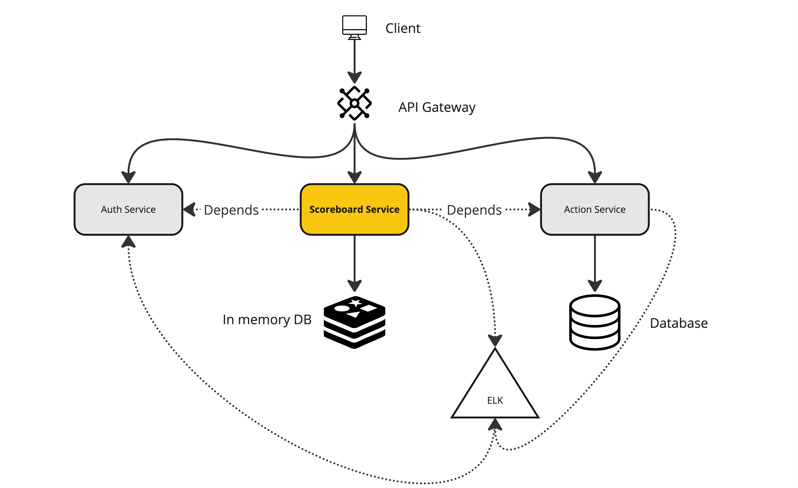
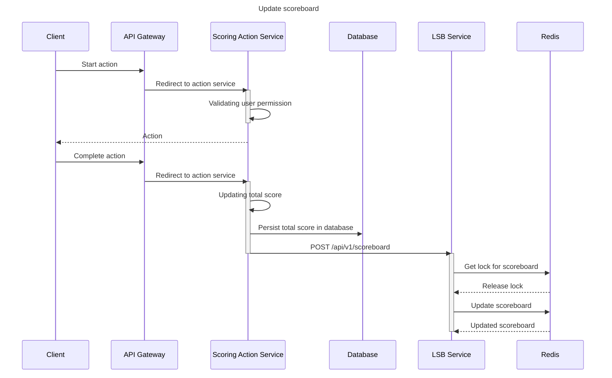
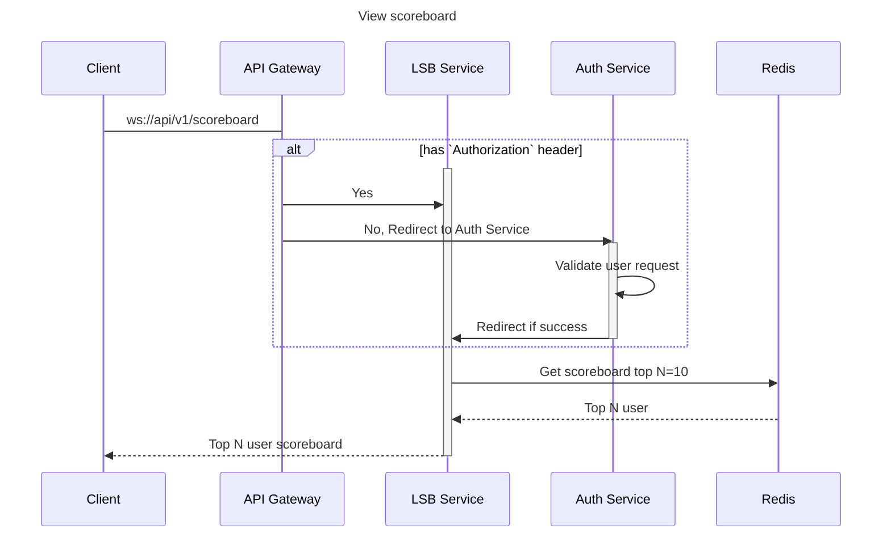
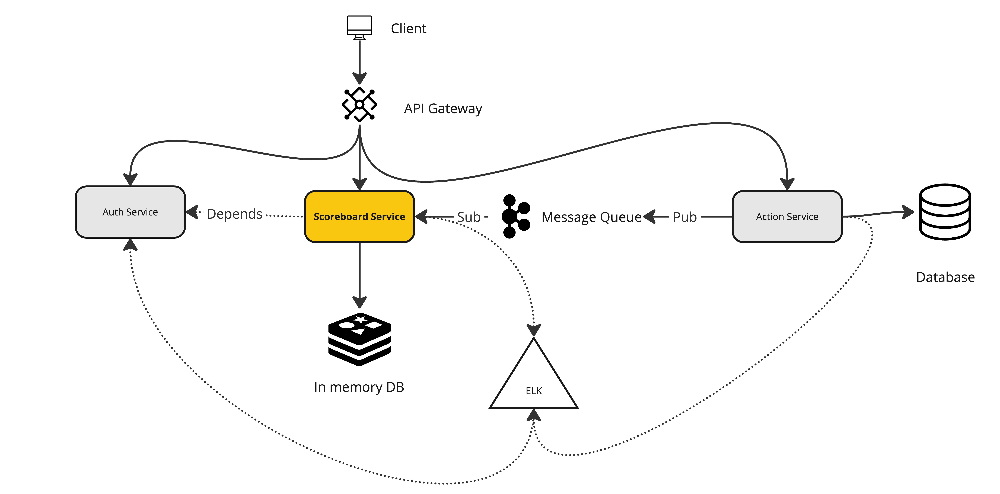

# Live Score Board Service - Technical Design Document

## Feature Overview

|             |                  |
| ----------- | ---------------- |
| **Team**    | Scoreboard team  |
| **Feature** | Live Score Board |
| **Tier**    | Backend          |
| **Owner**   | Jamie Le         |

### Dependencies

| Team/Feature               | Reason                                                                   |
| -------------------------- | ------------------------------------------------------------------------ |
| **Action service**         | Our service is a downstream of action service                            |
| **Authentication service** | Our service will use the authentication service to authenticate the user |
| **Infrastructure team**    | We depends on infrastructure team to deploy our service                  |

# Table of content

Should be available automatically in Github MD

# FAQ & Assumption

> Since this is the asynchronous test, I will make assumptions to my questions like below

## Business Questions

|                                                                     Question                                                                     |                                                   Assumption                                                    |
| :----------------------------------------------------------------------------------------------------------------------------------------------: | :-------------------------------------------------------------------------------------------------------------: |
|                                 Is this the ad-hoc task (task can only be done once) or it is a recurring task?                                  |        This should be periodically task. Users gain accumulated point every time they complete the task         |
|                                       What is the maximum number of action that end user can take per day?                                       |                                                    Once/day                                                     |
|                                                      Can end user see their friend's score                                                       |                                   No, we dont have the social feature for now                                   |
| Do we have different type of action or just one action across our system? If yes do we have to categorize the leaderboard depends on the action? |                                  No we just have 1 action across our platform                                   |
|                                                   How many point a completed action can earn?                                                    |                     It should vary depends on how user complete the task (time, strike,etc)                     |
|                                                       Can the end-user retake the action?                                                        |                                          No, we do not allow to retake                                          |
|                            Which component will be the consumer of this service? FE, another 3rd party service, etc?                             |                           Our FE website will be the main consumer of the LSB service                           |
|                                      Do we have to long-time persist the scoreboard or it can be temporary?                                      | This is an open questions. For now we can work with temporary case but in future, it should be open for persist |
|       How long a user will spend on live scoreboard screen? If it is long, we can do websocket, otherwide, polling solution would be fine        |        Assume in real case, a user can stay on the scoreboard for a long time to see others participants        |

## Technical Questions

|                                Question                                |                                                                                                  Assumption                                                                                                   |
| :--------------------------------------------------------------------: | :-----------------------------------------------------------------------------------------------------------------------------------------------------------------------------------------------------------: |
|       What is the current high level architecture of our system        |                                                       We are following the microservice architecture that each team will in charge of their own service                                                       |
| Do we have the action service or it is part of the scoreboard service? | The action service is a separate service that will in charge for granting score to end user when they complement the task. It will make a call to downstream service to update the user's score & leaderboard |
|                 What is the current DAU of our system                  |                                                                                           The current DAU is 100000                                                                                           |
|           What is the current technology stack of our system           |                                                Assuming we are using NodeJS as our backend primary stack, along with different database and analytics options                                                 |
|       How are we deploying our system? Cloud or native solution        |                                                                       We are using cloud as our primary deployment option (mainly AWS)                                                                        |
|               What is the write/read ratio of our system               |                                             Assuming each user views the scoreboard 2 times a day, and each user completes the task once a day => Write/Read=1/2                                              |
|      Do we have any constraint on Authentication & Authorization?      |                                                                       No, we can implements any Authentication & Authorization solution                                                                       |

## Non Functional Questions

| Question | Assumption |
| :------: | :--------: |
|          |            |

# Introduction

## Glossary

- LSB: Live Score Board
- Scoring Action: End user action that will receive a number of score when they complete the task
- POC: Proof of concept. Piece of code that can be used to test the concept or illustrate a technical implementation

## Problem statement

We are having a website that allows end user to perform a specific task ([Scoring action](#11-glossary)). Each action will receive a number of score. We need to implements a **live scoreboard** & related backend service that show the **top N users with the highest score**. The user must be **authenticated & authorized** before taking the Scoring action

## Requirements & Scopes

### Include

- We will cover the technical design of the service and requirements
- We will design, implements the APIs & data models used by the service
- We will showcase the flow for real-time updating the scoreboard and retrieve top N users
- We will cover the non-functional requirements

### Exclude

- We won't address the implementation of the action service
- We won't address how to spin up the needed infrastructure. However, we can show case how we use the infrastructure component in our service

## Risks & mitigations

> This section will list down risks and how we can mitigate them during the implementation phase

### Data race

- Cause: As we have many user interacting with our service at the same time, we need to make sure the data is consistent and synchronized across the platform.
- Mitigation: We will try to avoid the data race by using Distributed Lock solution, that try to lock the scoreboard when we are updating it.

### 3rd party integration

- Cause: As we might need to integrate with 3rd party service (authentication, action service), we need to make sure the upstream service is available and we can handle the failure gracefully
- Mitigation: We will try to implements as much integration test as possible to make sure the service is working as expected

### Leaking of environment variables

- Cause: As we might need to store connection string, envs, config in the environment variables, we need to make sure the environment variables are not leaked to the public
- Mitigation: We will try to use the environment variable management tool to manage the environment variables. We will also try to use the secret management tool to manage the sensitive information. It would be greate if we already have the vault that can use to store secrets

# System overview

## Current System State

- Currently, we are following the micro services architecture. We have different services that are responsible for different features, depends on the domain.
- Some services & components might related to our service during implementation are:

  - **Authentication service**: This service is responsible for authenticating the user and providing the token to the user
  - **Action service**: This service is responsible for granting score to the user when they complete the task
  - **Database**: This is the database that we will use to store the user's score & related information
  - **In memory DB**: This will acts as our cache & distributed lock component
  - **Gateway**: This is the gateway that we will use to route the request to the correct service
  - **Logging & Monitoring**: This is the logging and monitoring service that we will use to log the service's activity and monitor the service's health

## Technical consideration

For this specific service, we will create this service from scratch. This service should also be isolated and can works independently with high scalability since we might have many users interacting with the service at the same time.

The service will follow both **RestAPI & Websocket** to implements the live scoreboard. **In case we find out that write/read ration is low, we can consider using polling solution instead of websocket**

## Technology stacks & libraries

- Programming language: TypeScript
- Backend framework: NodeJS (Express)
- Core libraries:
  - Redis
  - Web socket
- Database: Postgres
- In-mem DB: Redis
- Authentication & Authorization methd: Oauth2 + JWT
- API Gateway: Kong
- Logging & Monitoring: ELK stack
- CI/CD: Github Actions/Gitlab CI

# Technical design

## Architecture


Components:

- **Client**: Frontend application that interact with our platform
- **API Gateway**: A gateway that can route the request to the correct service
- **Authentication service**: A service that can authenticate the user and provide the token to the user. Auth Service should support OAuth2 & RBAC with JWT
- **Action service**: A service that can grant score to the user when they complete the task
- **Live scoreboard service**: A service that can show the top N users with the highest score
- **Database**: A database that can store the user's score & related information
- **In-memory DB**: A database that can store the user's score and scoreboard
- **Logging & Monitoring**: We use ELK stack to monitor the service's activity and log the service's activity

## Flow

### Update scoreboard

`POST /api/v1/scoreboard` - This API will be used to update the scoreboard when the user completes the task.



### View scoreboard

`ws://api/v1/scoreboard` - This API will be used to retrieve the scoreboard



## Data Models

We will have 2 main data models that we will use in our service

1. `UserCompletedTask` event
   `UserCompletedTask` event is an event will be send to LSB service from `Scoring action` indicates that the user has completed the task. The event should contains user basic information and their total score

```
UserCompletedTask {
  eventId: string # event id
  userId: string # user id
  name: string # User name
  score: number # Total score of the user
  totalCompletionTime: number # In millisecond since epoch
}

```

2. Scoreboard
   Scoreboard is an object that contains the top N users with the highest score. Scoreboard will be saved as an `SortedSet` in Redis for fast retrieval & frequent update

```
Scoreboard {
   users: User[] # sorted desc by score, limit by N default to 10
   updatedAt: number # In millisecond since epoch
}

```

# APIs implementation

## Spike

This section will breifly showcase the implementation of the APIs in our service by POC

### Update scoreboard

This below illustrate the implementation steps for updating the scoreboard. It should include these steps

1. Getting userId & score
2. Get lock for scoreboard
3. Update the scoreboard
4. Release the lock
5. Return the success status

```ts
router.post("/api/v1/scoreboard", authMiddleware, async (req, res) => {
  // Retrieve userId, score & total completed time
  const { userId, score, totalCompletionTime } = req.body;

  // Get lock for scoreboard
  await redisClient.set("scoreboard_lock", "locked", "EX", 10, "NX");

  // Update the scoreboard
  await redisClient.zadd("scoreboard", score, userId);

  // Release the lock
  await redisClient.del("scoreboard_lock");

  // Return the success status
  res.status(200);
});
```

### View scoreboard

This below illustrate the implementation steps for viewing the scoreboard. It should include these steps

1. Get the scoreboard from Redis
2. Return the scoreboard to the client

```ts
router.ws("/api/v1/scoreboard", authMiddleware, async (req, res) => {
  // Get the scoreboard from Redis
  const scoreboard = await redisClient.zrevrange(
    "scoreboard",
    0,
    10,
    "WITHSCORES"
  );

  // Return the scoreboard to the client
  res.status(200).json(scoreboard);
});
```

## NOTICE: Technique used in implementation

### Distributed Lock

We use Redis as our in-memory DB. We will use Redis to implement the distributed lock for our scoreboard. We will use the `setnx` command to set the lock and `del` command to release the lock

> By doing this, we can maintain the data consistency and avoid the race condition when many user trying to access and the scoreboard at the same time

### Redis SortedSet

We will use Redis SortedSet to store the scoreboard. We will use the `zadd` command to add the user to the scoreboard and `zrevrange` command to retrieve the top N users with the highest score.

> This is an effective solution with that has built in in Redis to work with scoreboard & ranking data

### Message Queue

Although this is not included in our V1 architecture, however, it is good to have the MQ in our system as it will allow us to decouple the service and make the service more scalable. It will also helps us to store events sent by Scoring Action service while waiting for our LSB service to be ready to process the event.

### RBAC compatibility

We will use RBAC to authorize the user and validate that a user has the permission to get/update their score
sample permission list returned inside JWT token

```json
{
  "userId": "123",
  "permissions": ["scoreboard:get", "scoreboard:write"]
}
```

> In order to implements the RBAC, we can use passport.js to validate the token and user permission

### Analytics logs

For each of the critical point (etc: new scoreboard added), we will log the event to our logging service.

> Doing this will allow us to trace the event, easier to debug, recover and monitor the service's activity

## Authenticating & Authorizing

- We will need to authenticate the user before they can access the service. Authentication should be done via OAuth2
- We will need to authorize the user before they can access the service and sending updating the scoreboard. We will use RBAC to authorize the user and validate that a user has the permission to get/update their score
- For simplier understanding, assuming that Auth service is already implemented and we just need to validate to token & user permission from our side

## Deployment & Infrastructure

The deployment phase & infrastructure components will be handled by infra & devops team. However, these are requirements

1. We will need to deploy the service that can be horizontally scaled. It should be in **Auto Scaling group** or as a **Kubenetes pod**
2. We will need to deploy the service that can be accessed via the internet
3. We will need to spin up **ELK** as our **logging & monitoring** service
4. We will need to spin up **Redis** as our **in-memory DB** Credential will be stored in **Vault**
5. We will need **Auth Service, API Gateway & Scoring Action Service** to be accessible

# Non-functional Requirements

## CI/CD

- We will need to create a CI/CD pipeline to automate the deployment process
- The CI/CD should contains different stages
  - Static Analysis
    - Static code analysis
    - Code quality
  - Build
  - Test
    - Unit test
    - Integration test
    - E2E test
  - Deployment
    - Pull Request Deployment: For dev testing purpose
    - Alpha Deployment: For Dev team to test the service
    - UAT Deployment: QA team will test the service in this stage
    - Production Deployment: For end user to use the service

## Performance and Scalability

- We will need to make sure the service can handle the current DAU of our system
- We also need to perform load testing to make sure the service can handle the peak load while maintain the performance & real-time response
- The service should be implemented in a way that it can be scaled horizontally. Ideally we can containerize this service and deploy it to the different machine
- We should ask the devops/infra team to setup **Load Balancer** while scaling our application
- We should add the API rate limitting to avoid an user trying to spam getting the scoreboard or update many times, which could potentially slow down our system

## Security, Compliance and User Accessibility

- We have to make sure all action comes to the service will be authenticated and authorized
- We also need to make sure the service is protected from DDoS attack
- We have to make sure input sent to the service is validated
- Our Authentication & Authorization solution should be compliant with the current standard. It should has **Oauth2 with RBAC & JWT** feature support
- We need to make sure, connection string & sensitive information should be stored in **Vault**
- We need to make sure internet connection is encrypted

## Observability Plan

- The service should do logging at senstitive & critical points.
- We should plan for creating a distributed tracing solution.
- We should still plan the creation of a dashboard to monitor the performance of the service.
- We should also plan the creation of alerts for unexpected errors and high response times.

## Testing Plan

- We need to make sure have more than 80% test coverage
- We will need to create a few e2e tests to make sure the live scoreboard functionality works correctly
- Testing methods:
  - Unit test
  - Integration test
  - E2E test
  - Load test
  - Stress test
  - Pen test

## Maintenance and Support

- We need to document all related features & implementation to make sure it is clear for new comers & service consumer
- A ticket should be created to document this

# FAQ

# Improvements

Depends on the differnet in terms on requirement, we can improve the service by many ways

|                          Requirement                          |                                                                                                                                                                Solution                                                                                                                                                                |
| :-----------------------------------------------------------: | :------------------------------------------------------------------------------------------------------------------------------------------------------------------------------------------------------------------------------------------------------------------------------------------------------------------------------------: |
| The scoring action is extremely important and can not be lost |                                                             We should maintain a Message Queue, allow Scoring Service to publish in to the queue and have a LSB service to consume the message and update the scoreboard.                                                               |
|                         Write/Read~=1                         |                                             This is not consider a heavy-read anymore, we can do the **polling** as a method to retrieve the scoreboard. This will be easier in term of implementation and easy to scale . Also when using polling, we can do request caching using Redis                                              |
|                  If users has the same score                  | If 2 users has the same score, they will be sorted by their name. We can avoid this by using `${totalCompletionTime}#${userId}` as the key. Now it will be automatically sorted by total completion time [Redis SortedSet lexicographical scores](https://redis.io/docs/latest/develop/data-types/sorted-sets/#lexicographical-scores) |
|                                                               |                                                                                                                                                                                                                                                                                                                                        |

# References

- [Redis Sorted Set](https://redis.io/docs/latest/develop/data-types/sorted-sets)
- [Redis Distributed Lock](https://redis.io/docs/latest/develop/use/patterns/distributed-locks/)
- [ExpressJS websocket](https://www.npmjs.com/package/websocket-express)
